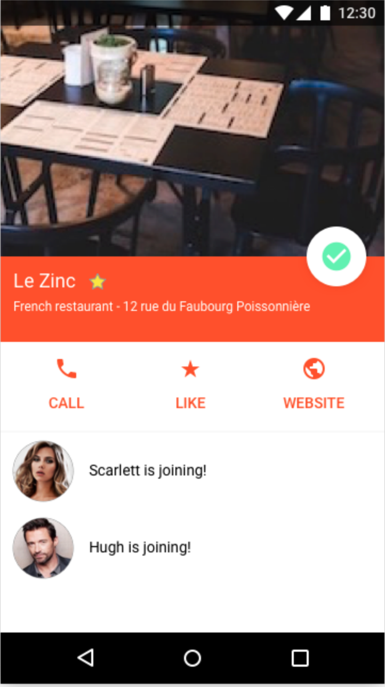

# Go4Lunch

    

## Description

The Go4Lunch app is a collaborative project that is used by company employees. This app allows the user to search nearby restaurants and to select the desired one. When a user has chosen the dining location, all of his colleagues are informed. Simultaneously, it’s possible to consult the restaurants selected by the co-workers in order to join them. 

Shortly before lunch, the app notifies every user to invite them to to meet up.

## API used

- Firebase
- FirebaseUI
- Facebook Login Support
- Google Maps (Places API & Nearby Places Search API)
- Retrofit 2
- Butterknife (Deprecated)
- RxJava
- Circle Image
- Glide
- Mockito+
- MVVM architecture 
